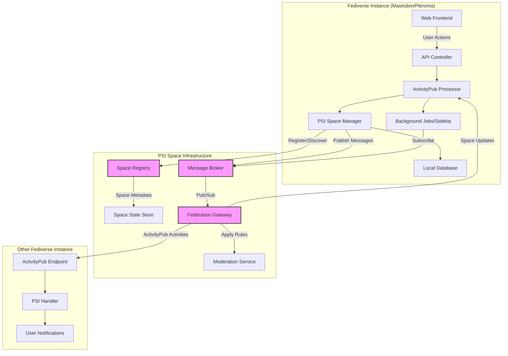
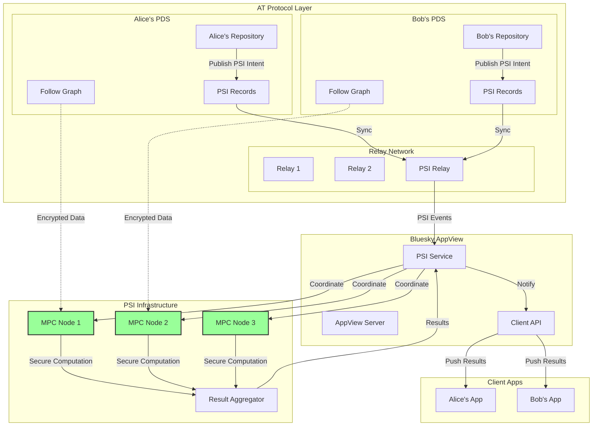
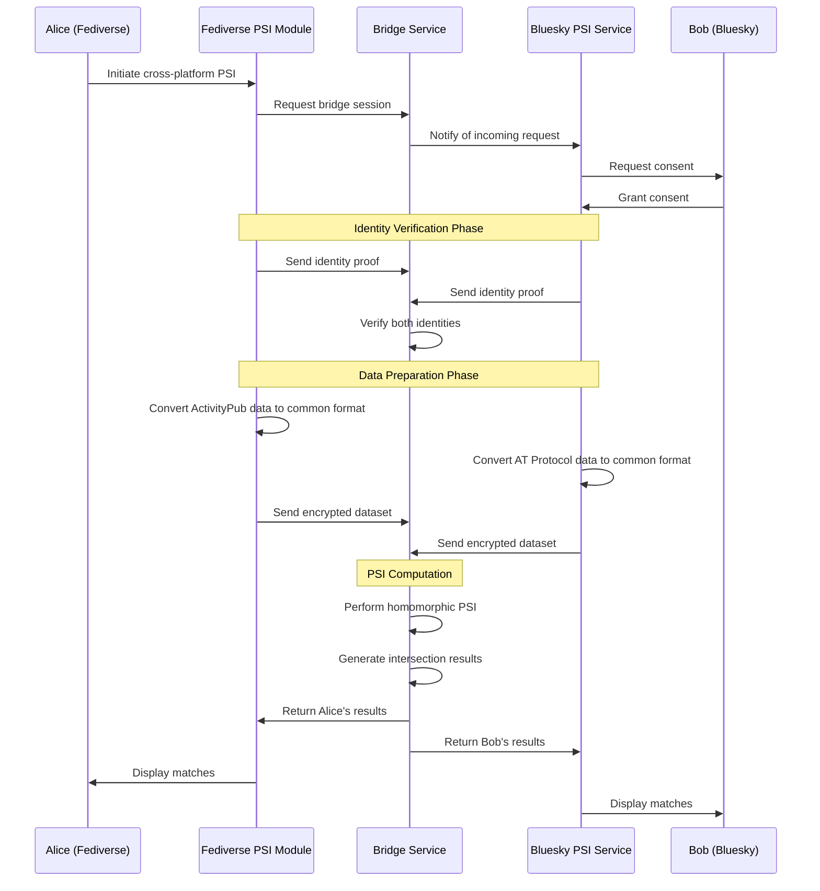

# Federated Services in Public Social Incubator
The Public Spaces Incubator aims to develop digital social spaces for open and fair communication as an alternative to commercially driven social media platforms that concentrate power.  
  
By design, the incubator distributes power around the world rather than in a single place, by including partners from various countries. To be truly successful, any newly created digital space will need to reflect this distribution of power by using a federated system as the technological architecture. 
  
Federation is a fundamental architectural pattern that influences almost all parts of the product and should be considered from the beginning of the development. It will allow the providers not only to integrate digital solution products into their own portfolio more easily, but also to actively exchange data posted by their users and create a deeply integrated network. All that while the partners are independent of one another.  
Without a federated approach exchange of data would be tied to strict rules and would require many specialized interfaces after the integration – otherwise data exchange would simply not be possible. Furthermore, user logins across the different systems would not be possible or require huge efforts after the first implementation of the software product.  
  
Despite being fundamental in software architecture, the decision to exchange data – and  what kind of data – can be determined later in the project.  
  
# Federated Services 
  
Federated services refer to the integration of multiple systems and services into a unified solution. This allows for the sharing of resources, information, and services across multiple organizations, without the need for a central authority to manage and control the exchange of data. 
  
Federated authentication verifies the identity of a user across multiple, independent systems. This should be done as a dedicated service, such as a single sign-on (SSO) provider, which handles the authentication for all other services. The SSO provider may also be integrated as a service into the product itself. 
  
Federated authorization determines what actions a user is allowed to perform based on their identity and the resources they are trying to access. This can be done in a decentralized manner, with each system making its own authorization decisions based on the user's identity and the permissions they have been granted.

# Federation in multiple stages:
1. no federation
2. federation between psi-instances (maybe intermediate protocol)
3. federation with third party application, such as mastodon or bluesky
  

# Integration with Fediverse


# Overview
PSI allows two parties to find common elements in their datasets without revealing the non-matching elements. This is particularly useful for:

* Finding mutual followers/connections privately
* Discovering shared interests without exposing all preferences
* Cross-platform friend discovery while preserving privacy

## Fediverse Integration
The Fediverse uses ActivityPub protocol, where each instance maintains its own user database. Here's how PSI would work:Fediverse PSI Integration ArchitectureDiagram Fediverse PSI Implementation Details

PSI Module Integration: Each Fediverse instance would need a PSI module that:

* Interfaces with the existing ActivityPub implementation
* Manages cryptographic operations for set encryption
* Handles communication with the PSI coordination service

## ActivityPub Extension: We'd extend ActivityPub with new activity types

Example for one type extension:

```json
{
  "@context": "https://www.w3.org/ns/activitystreams",
  "type": "PSIVideoVotingRequest",
  "actor": "https://mastodon.social/users/alice",
  "object": {
    "type": "PSIOperation",
    "target": "https://psi.social/users/bob",
    "dataType": "videoVoting",
    "consentToken": "..."
  }
}
```

### Privacy-Preserving Protocol Flow:
1. Alice@mastodon.social wants to find mutual connections with Bob@pixelfed.social
2. Both users consent to the PSI operation
3. Each instance encrypts their user's connection lists using homomorphic encryption
4. Encrypted sets are sent to a neutral PSI coordination service
5. The service computes the intersection without learning the actual data
6. Results are returned to both parties

## AT Protocol/Bluesky Integration
The AT Protocol uses a different architecture with Personal Data Servers (PDS) and a firehose of all activities. Here's how PSI would integrate:

## Integration with Bluesky




### AT Protocol PSI Implementation Details

#### Lexicon Extensions: Define new record types in AT Protocol's Lexicon schema
```typescript
// com.atproto.psi.request
{
  lexicon: 1,
  id: "com.atproto.psi.request",
  defs: {
    main: {
      type: "record",
      record: {
        type: "object",
        properties: {
          targetDid: { type: "string", format: "did" },
          dataType: { type: "string", enum: ["follows", "likes", "posts"] },
          consentProof: { type: "string" },
          encryptedSet: { type: "bytes" }
        }
      }
    }
  }
}
```
#### Multi-Party Computation (MPC): Unlike the Fediverse approach, AT Protocol's architecture allows for more sophisticated MPC:

Multiple nodes perform the PSI computation
No single party learns the complete datasets
Results are only revealed to the authorized participants


#### Integration Points:

PDS Level: Store PSI-related records and encrypted sets
Relay Level: Dedicated PSI relay for coordinating operations
AppView Level: PSI service integrated with Bluesky's AppView
Client Level: UI for initiating and viewing PSI results

## Cross-Platform Bridge
Here's how to enable PSI between Fediverse and AT Protocol:



### Cross-Platform Considerations

#### Identity Mapping:

Fediverse uses WebFinger (acct:user@domain.com)
AT Protocol uses DIDs (did:plc:...)
Bridge maintains a mapping service with user consent


#### Data Normalization:
```json
# Common data format for cross-platform PSI
{
  "user_id": "normalized_identifier",
  "data_type": "connections",
  "items": [
    {
      "id": "normalized_user_id",
      "platform": "fediverse|bluesky",
      "original_id": "platform_specific_id"
    }
  ]
}
```

### Security Considerations:

* End-to-end encryption of all data
* Zero-knowledge proofs for identity verification
* Temporal keys that expire after PSI operation
* Audit logs for compliance
