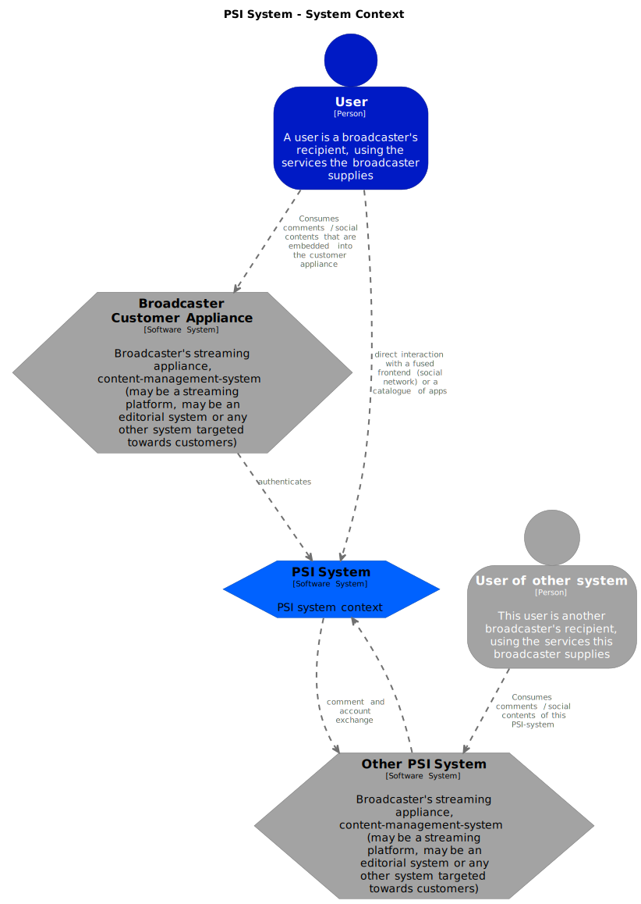
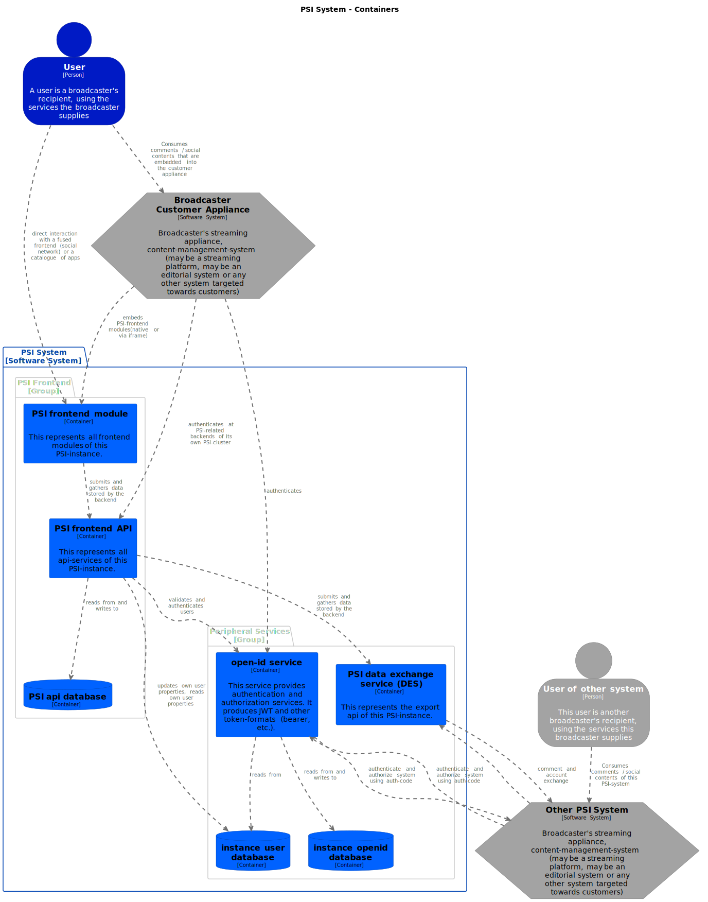
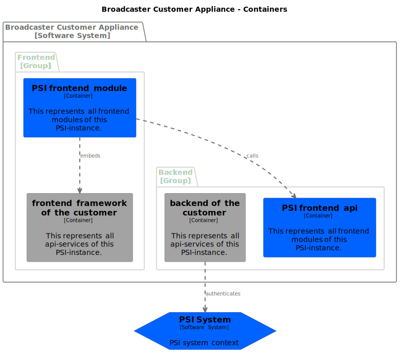
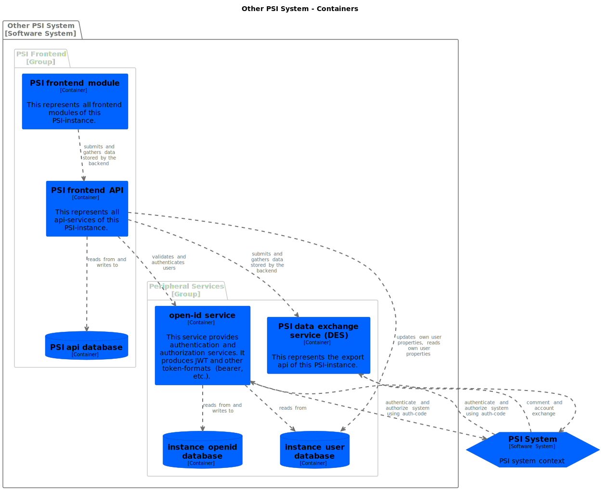

# PSI Global Architecture

This is a very early planning stage of the complete system.

## A brief introduction on the C4-Model
The C4-Architecture-Model is not a standard but a model that helps designing software on different levels. You can compare the view-model to any map-provider, where you start on a very far overview of the model and are able to zoom into the map.  
C4 defines 4 zoom levels as default: System Context diagram, Container Context diagram, Component diagram, Code diagram.  
In the early design-phase of this project we are going to focus on System Context and Container context. You will find deeper information on the idea behind C4 on their website [c4model.com](https://c4model.com/){:target="_blank"}

## System Context Overview
To have a compact overview over all systems involved in our design, we can have a look at the System Context:

The systems involved communicate with each other using apis or message queues. They authenticate with each other using the openid provider and client of the system.

## Container Context Owned PSI
The psi-system consists of the following containers that are relevant in the context of federation:

## Container Context Customer Containers_customer_appliance
The assumed containers that are relevant in the context of federation in the customers appliance are abstracted as follows:

## Foreign PSI-Systems
The context of the other psi-systems looks like this:

